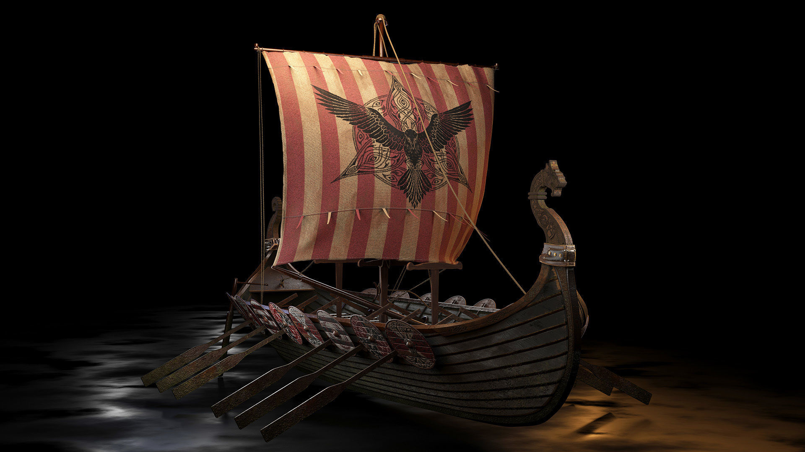
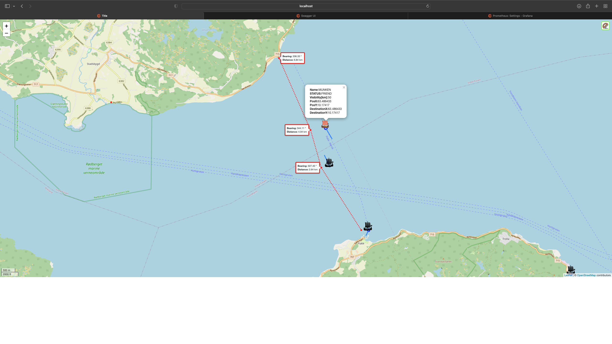

# AIS

## Bussines requirements
There is a business need to show ships on map by using AIS system.

## Project requirements
- [x] as a user with role TESTER/QUALITY/USER  I would like to log in to be able to block fixture in FIS
- [x] as a user with role TESTER/QUALITY/USER I would like to have recorded fixture status change or name  in history log and email
- [x] as a user with role TESTER/QUALITY/USER  I would like to see history log
- [x] as a user with role TESTER/QUALITY/USER  I would like to see fixture status
- [x] as a user with role TESTER/QUALITY/USER I would like to log in to be able to see status of fixture
- [x] as a user with role TESTER/QUALITY/USER I would like to have possibilities to choose languages Polski|English|Deutsch|Pyсский
- [x] as a user with role TESTER/QUALITY/USER I would like to use API for this
- [x] as a user with role TESTER/QUALITY/USER I would like to have
- [x] as a user with role TESTER  I would like to login to be able as the only one to create new fixture (name and Type(ICT,SMT_MOL))
- [x] as a user with role QUALITY I would like to login to be able as the only one to unlock fixture in FIS

# Solution

### OpenPoints
- [x] AIS
- [x] ruler for distance calculation  (plugin was added)
- [x] map's scale is presented in left-bottom corner (plugin was added)
- [x] ship's status change (icon and info are changed)-> FRIEND(click),ENEMY(dbclick)
- [x] circle around corresponds to weather visibility
- [x] direction and speed  of movement is presented by the polygon
- [ ] Security -> CAPTAIN, SAILOR
- [ ] email
- [ ] Locale i18n
- [ ] Profiles (dev(H2),prod)
- [ ] Inputs validation (frontend/backend)
- [ ] Suggestion for inputs (SetOK,SetNOK,FixtureName)
- [ ] Tests -> ongoing
- [x] REST API with Swagger UI
- [x] log history
- [x] healthChecks metrics, prometheus, Grafana
- [x] Docker

### Used Technologies
- SpringBoot (Spring Data, Spring Security)
- Postgres
- Docker
- Thymeleaf with Bootstrap
- Swagger UI
- Grafana
- Docker-Compose

## Info

### links
- app    -> http://localhost:8080
- API    -> http://localhost:8080/swagger-ui.html
- metrics-> http://localhost:8080/actuator
- prometheus -> http://localhost:9090
- http://localhost:3000 -> grafana (login:admin pass:admin) ; url http://prometheus:9090; import jvm Micrometer ID 4701

### Reference Documentation

Tytuł projektu, oraz czemu służy Twoje rozwiązanie
Jak uruchomić Twoją aplikację
Screeny i/lub film prezentujący Twoją rozwiązanie w działaniu

Pracę konkursową prześlij w następującym formularzu do 5 grudnia 2021 do godziny 23:59: https://forms.gle/VCqeLHL4mF6UrECP9

4. Zadanie konkursowe:

Wykorzystując dane pobierane z AIS utwórz aplikację, która będzie wyświetlała informacje na temat jednostek morskich na mapie.

Co dokładnie i w jakim celu ma to realizować? – To Twoja inwencja, pokaż Nam jaki, ciekawy projekt można zrealizować.

Może być to aplikacja do śledzenia jednostek w czasie rzeczywistym, projekt gdzie wcielasz się w jednostek na mapie i swobodnie nią sterujesz, lub dowolny inny projekt! Chcemy zobaczyć Twój pomysł 😊

Do swojej implementacji koniecznie wykorzystaj:

Hibernate
PostgreSQL
Docker
Ale również możesz dodać dowolną wybraną przez Ciebie technologie – bez ograniczeń, liczy się inwencja 😊

Możesz w pełni wykorzystać kod źródłowy opracowany w trakcie LiveStrema w ramach, którego ogłoszony był konkurs i dowolnie go rozbudować.

* Do pobierania informacji na temat lokalizacji statów:
* * https://www.barentswatch.no/en/about/open-data-via-barentswatch/
* * https://www.barentswatch.no/minside/

Marker rotation -> needs to have  -> npm install leaflet-marker-rotation

* [Official Apache Maven documentation](https://maven.apache.org/guides/index.html)
* [Spring Boot Maven Plugin Reference Guide](https://docs.spring.io/spring-boot/docs/2.6.0/maven-plugin/reference/html/)
* [Create an OCI image](https://docs.spring.io/spring-boot/docs/2.6.0/maven-plugin/reference/html/#build-image)
* [Spring Web](https://docs.spring.io/spring-boot/docs/2.6.0/reference/htmlsingle/#boot-features-developing-web-applications)
* [Thymeleaf](https://docs.spring.io/spring-boot/docs/2.6.0/reference/htmlsingle/#boot-features-spring-mvc-template-engines)
* [JDBC API](https://docs.spring.io/spring-boot/docs/2.6.0/reference/htmlsingle/#boot-features-sql)

### Guides

The following guides illustrate how to use some features concretely:

* [Accessing data with MySQL](https://spring.io/guides/gs/accessing-data-mysql/)
* [Building a RESTful Web Service](https://spring.io/guides/gs/rest-service/)
* [Serving Web Content with Spring MVC](https://spring.io/guides/gs/serving-web-content/)
* [Building REST services with Spring](https://spring.io/guides/tutorials/bookmarks/)
* [Handling Form Submission](https://spring.io/guides/gs/handling-form-submission/)
* [Accessing Relational Data using JDBC with Spring](https://spring.io/guides/gs/relational-data-access/)
* [Managing Transactions](https://spring.io/guides/gs/managing-transactions/)

  