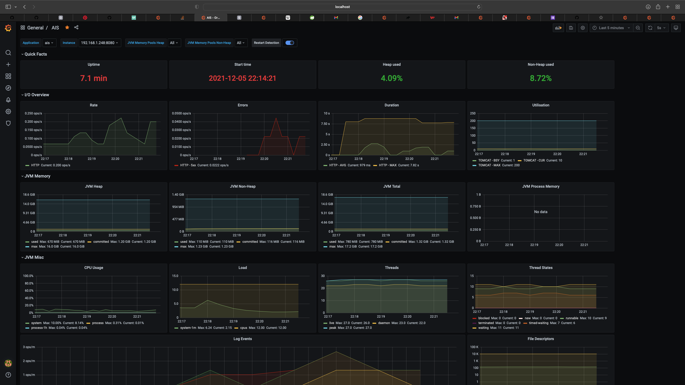
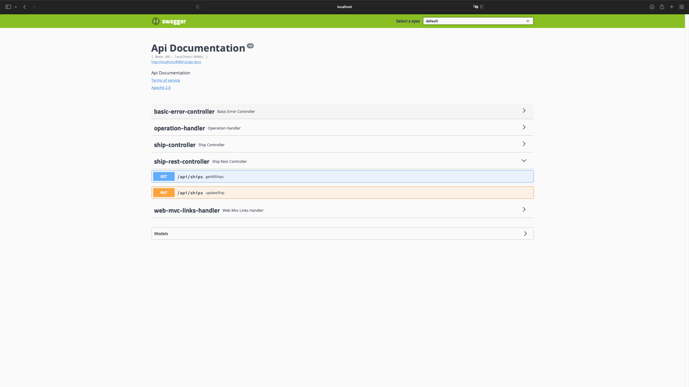
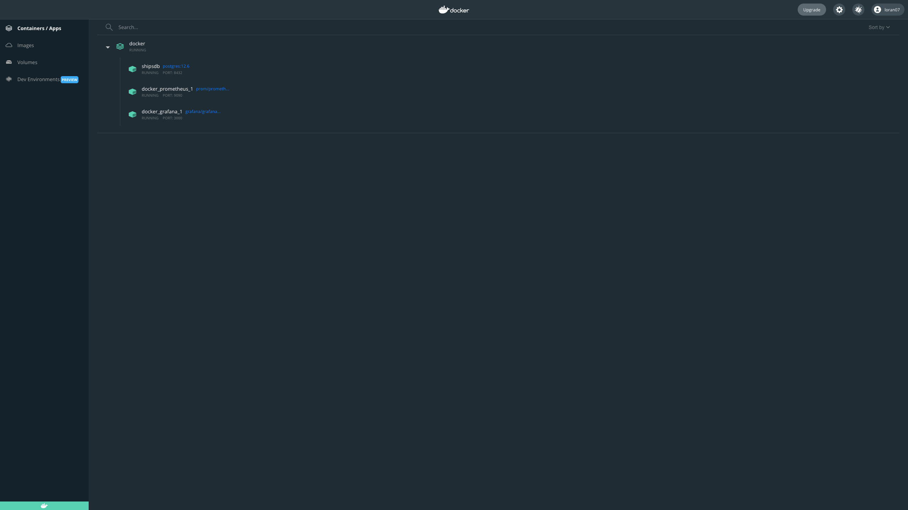

# AIS

## Business requirements
There is a business need to show ships on map by using AIS system.

## Project requirements
- [x] as a user I would like to see ships to locate them
- [x] as a user I would like to know direction and speed  of ships
- [x] as a user I would like to have possibility to mark ship as FRIEND or ENEMY 
- [x] as a user I would like to see the scale of the map 
- [x] as a user I would like to have possibility to measure a distance between severals points on the map 
- [x] as a user I would like to have stable application  thats why I need to monitor my application 
- [x] as a user I would like to get email when status FRIEND <-> ENEMY will be changed
- [x] as a user I would like to have possibility to use REST API to be able to connect via Postman or external app

# Solution

### DONE
- [x] AIS
- [x] refresh site in cycle 65sec 
- [x] ruler for distance calculation  (plugin was added)
- [x] map's scale is presented in left-bottom corner (plugin was added)
- [x] ship's status change (icon and info are changed)-> FRIEND(click),ENEMY(dbclick)
- [x] circle around corresponds to weather visibility (due to the limits(50requests/day) from stormAPI the random  values were generated )
- [x] direction and speed  of movement is presented by the polygon
- [x] email  -> "Ship MUNKEN was updated"
- [x] Profiles (dev,prod)
- [x] Inputs validation
- [x] unit Test
- [x] REST API with Swagger UI
- [x] log history
- [x] healthChecks metrics, prometheus, Grafana
- [x] Docker-compose 

### TO DO
- [ ] Security -> CAPTAIN, SAILOR
- [ ] Locale i18n
- [ ] unit Tests -> ongoing
- [ ] integration test

### Used Technologies
- SpringBoot
- Postgres
- LeafLet
- Docker
- Thymeleaf with Bootstrap
- Swagger UI
- Grafana
- Docker-Compose

## Info

### links
- app    -> http://localhost:8080
- API    -> http://localhost:8080/swagger-ui.html
- metrics-> http://localhost:8080/actuator
- prometheus -> http://localhost:9090
- http://localhost:3000 -> grafana (login:admin pass:admin) ; url http://prometheus:9090; import jvm Micrometer ID 4701

### Reference Documentation

Tytuł projektu, oraz czemu służy Twoje rozwiązanie
Jak uruchomić Twoją aplikację
Screeny i/lub film prezentujący Twoją rozwiązanie w działaniu

Pracę konkursową prześlij w następującym formularzu do 5 grudnia 2021 do godziny 23:59: https://forms.gle/VCqeLHL4mF6UrECP9

4

. Zadanie konkursowe:

Wykorzystując dane pobierane z AIS utwórz aplikację, która będzie wyświetlała informacje na temat jednostek morskich na mapie.

Co dokładnie i w jakim celu ma to realizować? – To Twoja inwencja, pokaż Nam jaki, ciekawy projekt można zrealizować.

Może być to aplikacja do śledzenia jednostek w czasie rzeczywistym, projekt gdzie wcielasz się w jednostek na mapie i swobodnie nią sterujesz, lub dowolny inny projekt! Chcemy zobaczyć Twój pomysł 😊

Do swojej implementacji koniecznie wykorzystaj:

Hibernate
PostgreSQL
Docker
Ale również możesz dodać dowolną wybraną przez Ciebie technologie – bez ograniczeń, liczy się inwencja 😊

Możesz w pełni wykorzystać kod źródłowy opracowany w trakcie LiveStrema w ramach, którego ogłoszony był konkurs i dowolnie go rozbudować.

* Do pobierania informacji na temat lokalizacji statów:
* * https://www.barentswatch.no/en/about/open-data-via-barentswatch/
* * https://www.barentswatch.no/minside/

  